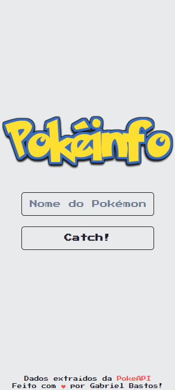

# PokeInfo

Esta é uma aplicação web (SPA) que providencia informações sobre qualquer Pokémon.

## Tabela de Conteúdos

- [Visão geral](#visão-geral)
  - [Sobre](#sobre)
  - [Imagens](#imagens)
  - [Como utilizar](#como-utilizar)
- [Tasks](#tasks)
- [Tecnologias e ferramentas](#tecnologias-e-ferramentas)
- [Contato](#contato)

## Visão Geral

### Sobre

A aplicação interage diretamente com a [PokéAPI](https://pokeapi.co/), consumindo-a e retornando informações sobre o que foi inserido pelo usuário. Caso tenha sido o nome de algum Pokémon, ela mostrará um card na tela contendo informações sobre o mesmo. Caso contrário, apresentará uma mensagem informando não ter sido um Pokémon.

### Imagens

### Como rodar

- Neste repositório, clique no botão `Code`, destacado em verde
- Copie o link contido na seção `HTTPS`
- Em sua máquina, utilize o comando `git clone` em seu terminal de preferência, seguido do link copiado, numa pasta local
  - `git clone https://github.com/bastie1/PokeInfo.git`
- Utilize o comando `npm install` para instalar as dependências do projeto
- Utilize o comando `npm start` para rodar o servidor local
- O projeto será aberto na página `http://localhost:3000`

## Tasks

- [ ] Resolver bug com o layout quebrando verticalmente
- [ ] Tornar o projeto responsivo para tablet e desktop
  - [ ] Resolver bug com a responsividade no modo paisagem
- [ ] Aprimorar design do card
  - [ ] Colorir o card conforme cada tipo/elemento de pokemon
  - [ ] Estilizar os tipos/elementos de cada pokemon com plano de fundo colorido, no formato de uma pílula
  - [ ] Tornar as sprites estáticas em gifs
- [ ] Refatorar a aplicação para melhor organização de código

## Tecnologias e ferramentas

&nbsp;
&nbsp;
&nbsp;
&nbsp;
&nbsp;

## Contato

&nbsp;
&nbsp;

 

Feito com ❤️ por [Gabriel Bastos](https://github.com/bastie1), entre em contato!
